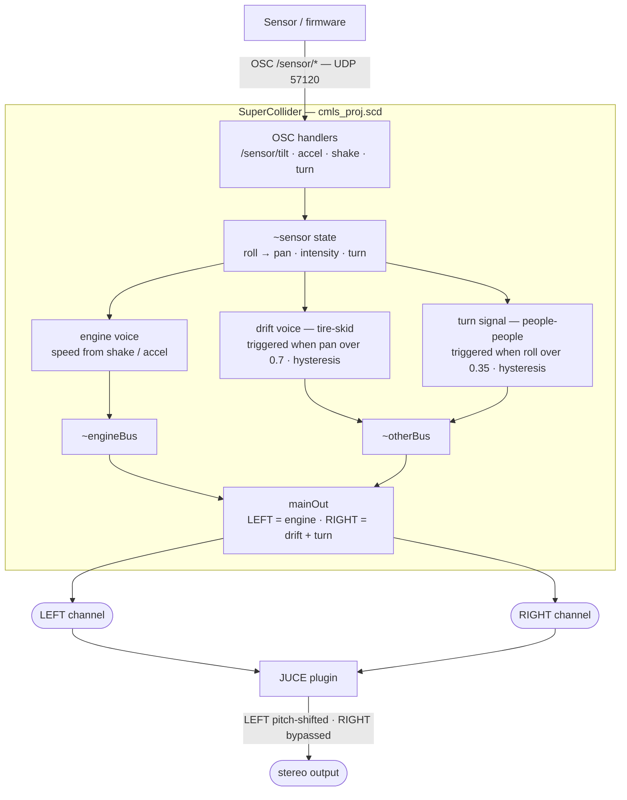

# CMLS Project - Sensor-Driven Sound Prototype

Current focus: **SuperCollider car-sound source**.

The project turns motion from a 3-axis accelerometer (on an RC car or handheld
board) into a car soundscape. SuperCollider synthesises three sounds — an
engine, a tire/drift skid, and a turn-signal melody — and reacts to sensor OSC
data in real time.

The output is split hard across the stereo field (engine on the LEFT channel,
everything else on the RIGHT) so a downstream JUCE plugin can pitch-shift only
the engine and leave the turn signal and drift untouched.

## What Works Today

- A single SuperCollider script (`supercollider/cmls_proj.scd`) acts as a
  self-contained sensor-to-sound console.
- Three sound sources: an **engine** (left channel), a noise-based **tire/drift
  skid**, and a rhythmic **turn-signal** melody (both on the right channel).
- A hard stereo split (LEFT = engine, RIGHT = drift + turn) so a JUCE plugin can
  pitch-shift only the engine and bypass the rest.
- Engine is always on; turn signal and drift are **triggered with hysteresis**
  (the blinker while turning, the skid only past a steeper lean).
- Two control modes selectable from the top of the script:
  - `\standaloneSC` (default): incoming OSC immediately drives engine revs,
    turn signal, pan, and the drift trigger.
  - `\pluginSource`: SC ignores sensor motion and stays a stable source so a
    future JUCE plugin can take over the modulation.
- A test runner (`supercollider/test.scd`) that boots, loads everything, and
  plays a no-hardware demo (idle → throttle → drift → turn signals → stop).
- A Python bridge (`bridge/bridge.py`) that emits the same OSC protocol from
  either real Arduino/MMA7361 input or a `--mock` sine wave for testing
  without hardware.

## Current Architecture

### SuperCollider signal flow



### Current SC-first demo

```text
[Accelerometer / mock data]
          |
          v
[Python bridge, optional] --OSC--> [SuperCollider]
                                  generates and controls sound
                                           |
                                           v
                                    speakers/headphones
```

### Future JUCE option

```text
[SuperCollider] --> [Virtual audio device] --> [JUCE plugin host]
   source audio                              sensor-controlled processing
```

The current deliverable does not require JUCE. The `juce/` folder is a
placeholder for later team work.

## Repository Layout

```text
cmls/
|-- supercollider/         Current focus: SC sound + sensor OSC control
|   |-- cmls_proj.scd      main project (engine + drift + turn, stereo split)
|   |-- engine.scd         engine voice SynthDef
|   `-- test.scd           one-shot boot + load + demo runner
|-- bridge/                Optional draft bridge: Arduino serial -> OSC
|   |-- arduino_accel/     Arduino sketch for MMA7361 (3-axis analog accel)
|   |-- bridge.py          Python serial/mock -> OSC sender
|   `-- requirements.txt
|-- juce/                  Placeholder for future JUCE plugin project
|-- docs/                  Placeholder for diagrams, report, demo media
|-- .gitignore
`-- README.md
```

## SuperCollider Modes

One control-mode variable near the top of `supercollider/cmls_proj.scd`:

```supercollider
~controlMode = \standaloneSC; // \standaloneSC or \pluginSource
```

- `\standaloneSC` (default): SuperCollider receives sensor OSC and directly
  shapes the sound — engine revs, turn signal, and the drift trigger. This is
  the main mode for the current prototype.
- `\pluginSource`: SuperCollider ignores sensor motion and stays a stable
  source so a future JUCE plugin can take over the modulation.

The engine is always on; the turn signal and drift are triggered on demand
(see Sensor Mapping below).

## Sensor Mapping

In `\standaloneSC` mode:

| Sensor data                  | Effect                                                          |
|------------------------------|-----------------------------------------------------------------|
| board roll (left/right tilt) | turn-signal direction (right rings higher, left lower); a steeper lean also triggers the drift/skid |
| shake / accel magnitude      | engine revs (idle → high RPM) and drift loudness                |

Both the turn signal and the drift use **hysteresis** so jitter near the
threshold doesn't chatter them on/off (turn on 0.35 / off 0.25; drift on 0.7 /
off 0.55, based on `|pan|`).

If the board feels inverted, change `tiltPitchPolarity` or `rollPanPolarity` in
`cmls_proj.scd` from `1` to `-1` (you can even do it live:
`~params.rollPanPolarity = -1;`).

## OSC Protocol

The current SC script listens on SuperCollider's default language port,
normally `57120`.

| Address          | Args                       | Notes                              |
|------------------|----------------------------|------------------------------------|
| `/sensor/accel`  | `x y z` floats, `-1..1`    | acceleration axes -> shake energy  |
| `/sensor/tilt`   | `roll pitch` floats, rad   | roll -> pan / turn / drift trigger |
| `/sensor/shake`  | `magnitude` float          | engine revs + drift loudness       |
| `/sensor/turn`   | `value` float              | explicit turn: <0 left, 0 straight, >0 right |

Debug controls:

| Address                | Args         | Notes                |
|------------------------|--------------|----------------------|
| `/control/master/amp`  | `amp` float  | master volume        |
| `/control/root/midi`   | `midi` float | root pitch in MIDI   |

## Running SuperCollider

1. Install SuperCollider 3.13+.
2. Open `supercollider/cmls_proj.scd`.
3. Evaluate the server config block, run `s.boot`, and wait until the server
   says it is ready.
4. Evaluate the remaining blocks from top to bottom.
5. Run:

```supercollider
~start.value;
```

Stop playback with:

```supercollider
~stop.value;
```

### 30-Second Demo Path

Fastest path — no hardware, no bridge, just the SC test runner:

```bash
sclang supercollider/test.scd
```

It boots the server, loads everything, and plays: idle → throttle → drift skid
→ left/right turn signals → stop.

To drive it from mock sensor OSC instead, run the bridge in one terminal:

```bash
cd bridge && python3 bridge.py --mock --debug
```

then in SuperCollider evaluate blocks 0–5 and `~start.value;` — the engine revs
and pans as the mock data comes in.

Or trigger sounds by hand in the IDE (no sensor needed):

```supercollider
~setTurn.value(1);    // right turn signal  (-1 left, 0 straight)
~setDrift.value(0.9); // start the drift/skid  (0 to stop)
```

## Optional Bridge Test

The bridge is not the main focus right now, but it can send mock sensor OSC
for SC testing.

```bash
cd bridge
python3 -m venv venv
source venv/bin/activate
pip install -r requirements.txt
python3 bridge.py --mock --debug
```

For real hardware later:

```bash
python3 bridge.py --port /dev/tty.usbmodem1101 --debug
```

The Arduino sketch targets an **MMA7361** 3-axis analog accelerometer and
prints `x,y,z` lines in g units at 50 Hz. Default wiring assumes:

- VCC -> 3.3V, GND -> GND
- X, Y, Z analog outputs -> A0, A1, A2
- SL (sleep) -> digital pin 4 (held HIGH to wake the sensor)
- GS (g-select) tied LOW for the +-1.5g range
- ST (self-test) tied LOW

If the team swaps to a different sensor, keep the same serial format
(`x,y,z\n` in g units) so the Python bridge does not need to change.
For wider headroom, tie GS HIGH (+-6g) and update `SENSITIVITY` in the
sketch and `ACCEL_RANGE_G` in `bridge/bridge.py` to match.

## Future JUCE Work

`juce/` is intentionally only a placeholder for now. If the team chooses the
JUCE route later, the plugin should:

- expose stereo audio input/output;
- receive OSC sensor messages, likely on `127.0.0.1:9001`;
- process SC audio with pitch, speed, pan, or effects driven by the sensor.

For that setup, route SuperCollider audio into a virtual audio device such as
BlackHole 2ch, then use that virtual device as the JUCE plugin host input.

## Team Workflow

- Keep `main` demo-ready.
- Use small feature branches such as `feat/sc-sensor-control`.
- Coordinate before changing the OSC address names or argument types.
